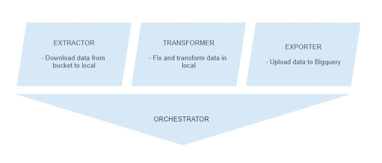

REQUIREMENTS

- ETL
    1) Download data from GCS bucket
    2) Transform data if applicable to Bigquery ingest
    3) Upload to Bigquery
    4) Divide result table in Data and geometries, joinable by a common key

- Data 
    1) QA 

- SQL 
    1) Average fare per mile
    2) Top 10 sites with highest tips

- LANGUAGE
    1) Python

ETL SCHEMA

